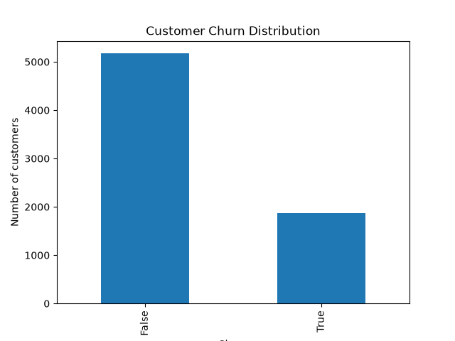
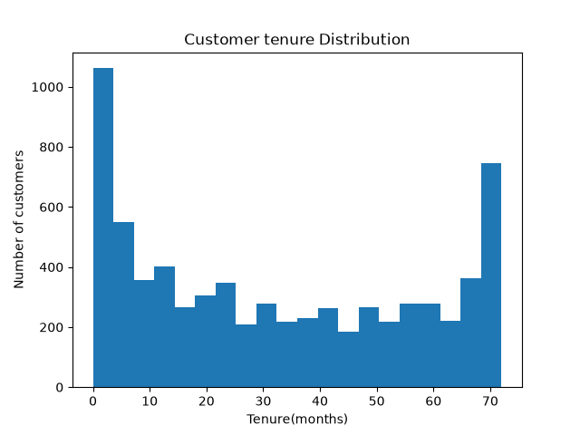
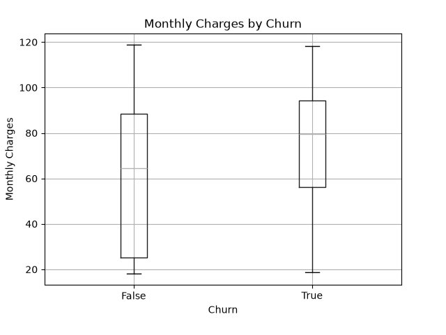
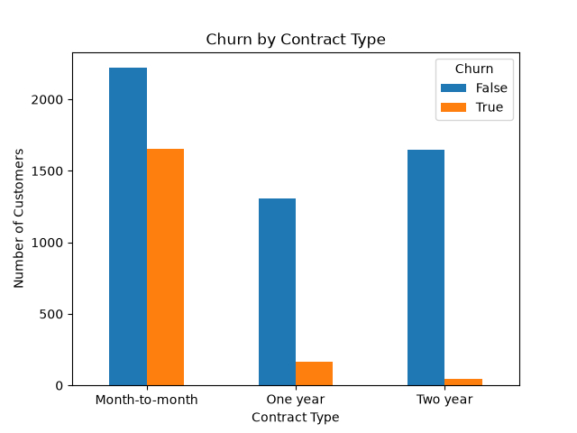

# ml-roadmap
My ML engineer roadmap- projects, notes and code as i build toward job-ready
## Phases

- [ Done] Phase 1 — Core Foundation (Python, NumPy/Pandas, Stats+LinAlg, Git, SQL)
- [ ] Phase 2 — Core ML (Regression, Trees, Model Evaluation)
- [ ] Phase 3 — Applied ML (Feature Engineering, XGBoost, Kaggle project)
- [ ] Phase 4 — ML Engineering (FastAPI, Deployment, Docker)
- [ ] Phase 5 — Specialization

## Currently on
Phase 1 — Foundation Sprint. Working on: data cleaning project.

## Projects
| Project | Phase | Status |
|---|---|---|
| Data cleaning project | 1 | In progress |

## Dataset Cleaning

### What Was Messy

The Telco Customer Churn dataset had some data quality issues that needed to be addressed before analysis. The main issues were:

* `TotalCharges` was stored as a text/object data type instead of a numeric type.
* Some records contained missing values.
* There were inconsistencies in categorical values, which could cause the same category to be treated as different values.

### What I Fixed

* Converted `TotalCharges` from object/string to a numeric data type.
* Identified and handled missing values.
* Standardized inconsistent categorical values.
* Checked the dataset after cleaning to ensure the data was consistent and ready for analysis.

### Why I Fixed Them

These issues could lead to errors during analysis and machine learning. Converting numerical columns to the correct data type makes calculations possible, handling missing values prevents incomplete records from affecting results, and standardizing categorical values ensures that identical categories are treated consistently.

The goal was to make the dataset clean, consistent, and suitable for further analysis and machine learning.

## Exploratory Data Analysis

### 1. Customer Churn Distribution

### 2. Customer Tenure Distribution

### 3. Monthly Charges by Churn

### 4. Churn by Contract Type

